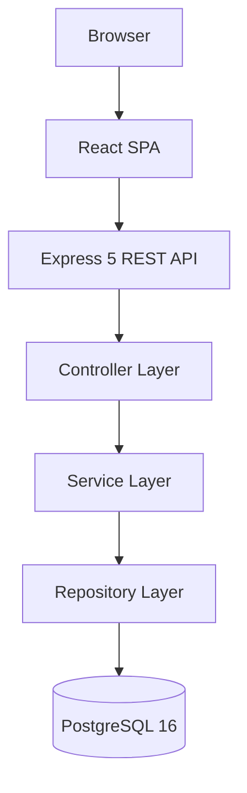

# Specification — AB-1017: Comprehensive Root README

**Ticket:** AB-1017
**Type:** Documentation
**Status:** COMPLETED
**Branch:** `docs/AB-1017-generate-comprehensive-readme`

---

## 1. Requirements

| ID | Requirement |
|----|-------------|
| R-01 | A `README.md` MUST be created at the repository root |
| R-02 | The README MUST contain a project title and one-liner description |
| R-03 | The README MUST include a feature overview (7 features: Auth, Notes CRUD, Tags, Search, Sharing, Version History, Soft-delete) |
| R-04 | The README MUST include a tech stack table |
| R-05 | The README MUST include a Mermaid architecture diagram |
| R-06 | The README MUST include an annotated repository structure tree |
| R-07 | The README MUST list prerequisites (Node 22, pnpm 9, PostgreSQL 16) |
| R-08 | The README MUST include Getting Started steps (clone → install → env → migrate → generate → dev) |
| R-09 | The README MUST document all required environment variables (backend + frontend) |
| R-10 | The README MUST include an available scripts table |
| R-11 | The README MUST include a full 21-endpoint API reference table |
| R-12 | The README MUST include a database schema summary (8 tables) |
| R-13 | The README MUST document the auth flow (token TTL, rotation, OTP reset) |
| R-14 | The README MUST document the testing strategy (unit, integration, E2E) |
| R-15 | The README MUST list quality gates (6-step checklist) |
| R-16 | The README MUST document non-functional requirements |
| R-17 | The README MUST list out-of-scope items |
| R-18 | The README MUST include contributing guidelines (branch naming, commit format) |

---

## 2. Acceptance Criteria

- [ ] `README.md` exists at repo root
- [ ] All 21 API endpoints are listed with method, path, auth requirement, and description
- [ ] Mermaid diagram renders correctly on GitHub
- [ ] Commands in Getting Started match actual root `package.json` scripts
- [ ] Port numbers match `apps/backend/src/server.ts` (default 3000) and Vite default (5173)
- [ ] DB table names match `@@map()` values in `prisma/schema.prisma`
- [ ] No mention of Docker, CI/CD, or OAuth (out of scope per FRS)

---

## 3. Affected Capabilities

| Capability | Impact |
|-----------|--------|
| Root README | New — `README.md` created |
| Documentation completeness | Improved — single entry point for contributors |

No source code, API contracts, database schema, or TypeScript interfaces are changed by this ticket.

---

## 4. Functional Behavior

### Architecture Diagram (Mermaid)

### Environment Variables
**Backend:**
- `DATABASE_URL` (required) — PostgreSQL connection string
- `ACCESS_TOKEN_SECRET` (required) — JWT signing secret
- `PORT` (optional, default 3000)
- `NODE_ENV` (optional)

**Frontend:**
- `VITE_API_URL` (required) — e.g. `http://localhost:3000/api`

### 21-Endpoint API Summary
Auth (6): register, login, logout, refresh, forgot-password, reset-password
Notes (5): list, get, create, update, delete
Tags (4): list, create, update, delete
Search (1): GET /search
Sharing (3): create share link, get public, revoke
Versions (3): list, get, restore

---

## 5. Dependencies

| Dependency | Type | Notes |
|-----------|------|-------|
| AGENTS.md | Source | Project overview, tech stack, architecture, API summary, DB schema |
| FRS.md | Source | Features, NFRs, out-of-scope items |
| SDS.md | Source | Design decisions |
| root package.json | Source | Script names and commands |
| `apps/backend/src/server.ts` | Source | Default port |
| `apps/backend/prisma/schema.prisma` | Source | Table names (`@@map()`) |
| All prior tickets | Context | Provides accurate API surface and feature list |
